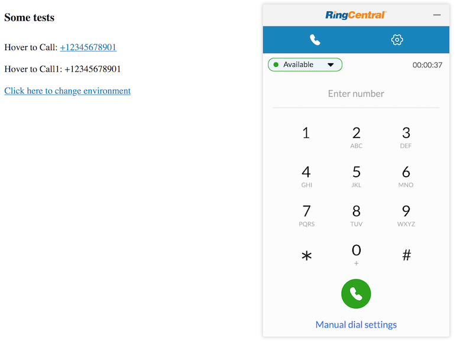

# Engage Voice Embeddable

## Introduction

Engage Voice Embeddable is an out-of-the-box embeddable web application that help developers to integrate RingCentral Engage Voice services to their web applications with few code.

## Visit Online

Visit GitHub pages: [https://ringcentral.github.io/engage-voice-embeddable](https://ringcentral.github.io/engage-voice-embeddable/)



## Inject into Web app

Add following code into any web app's page to make it work.

```html
<script>
  (function() {
    var rcs = document.createElement("script");
    rcs.src = "https://ringcentral.github.io/engage-voice-embeddable/adapter.js";
    var rcs0 = document.getElementsByTagName("script")[0];
    rcs0.parentNode.insertBefore(rcs, rcs0);
  })();
</script>
```

## Interaction with Embeddable widget

**Notice**: `RCAdapter` is provided after we inject Embeddable widget

#### Create a new Call

```js
RCAdapter.clickToDial(phoneNumber)
```

#### Register a logger and contact matcher service

Example to register logger and contact matcher service into Embeddable widget

```js
var registered = false;
window.addEventListener('message', function(event) {
  var message = event.data;
  if (!registered && message && message.type === 'rc-ev-init') {
    registered = true;
    RCAdapter.registerService({
      name: 'TestService',
      callLoggerEnabled: true,
      contactMatcherEnabled: true,
    });
    RCAdapter.transport.addListeners({
      push: function (data) { // listen push event from rc widget
        // new call event
        if (data.type === 'rc-ev-newCall') {
          console.log('new call:', data.call);
        }
      },
      request: function (req) { // listen request event from rc widget
        var payload = req.payload;
        // handle log request
        if (payload.requestType === 'rc-ev-logCall') {
          console.log('logCall:', payload.data);
          RCAdapter.transport.response({
            requestId: req.requestId,
            result: 'ok',
          });
          return;
        }
        // handle match contacts request
        if (payload.requestType === 'rc-ev-matchContacts') {
          var queries = payload.data;
          console.log('matchContacts:', queries);
          var contactMapping = {};
          queries.forEach(function (query) {
            contactMapping[query.phoneNumber] = [{
              id: query.phoneNumber,
              type: 'TestService',
              name: 'Test User ' + query.phoneNumber,
              phoneNumbers: [{
                phoneNumber: query.phoneNumber,
                phoneType: 'direct',
              }]
            }]; // Array
          });
          RCAdapter.transport.response({
            requestId: req.requestId,
            result: contactMapping,
          });
          return;
        }
      }
    });
  }
});
```
